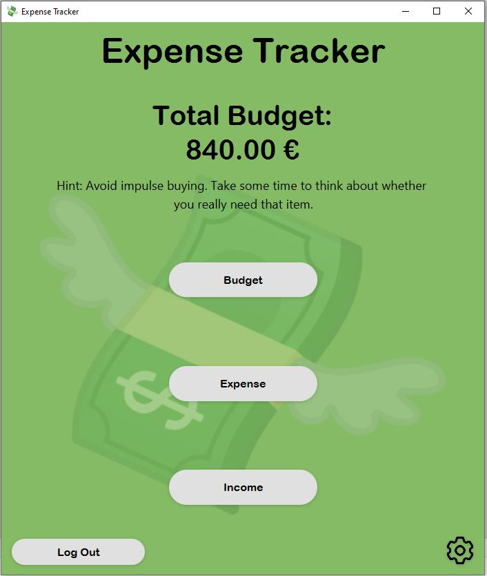
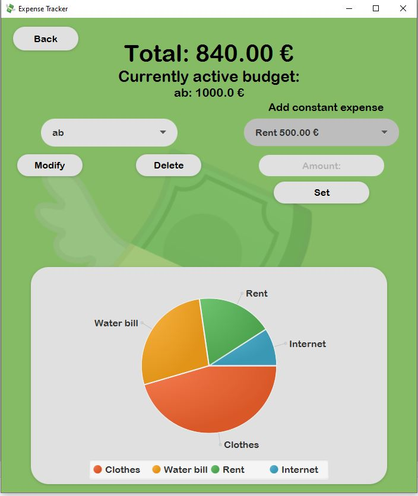
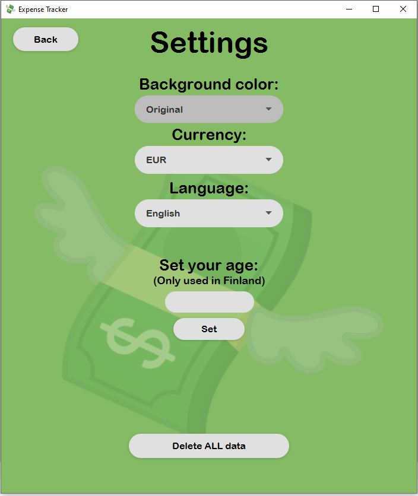

# Expense Tracker

Expense Tracker is a simple desktop application designed for tracking personal expenses. This project was created by a
team of four engineering students as part of the OTP1 and OTP2 courses at Metropolia UAS. Our goal was to learn agile
frameworks, so we took turns serving as the scrum master throughout the project.

## Features

* Create budgets and track expenses
* Extract expenses from budgets
* View income and add tax rate for accurate budget tracking
* Support for both hourly and monthly wage tracking
* View expenses in graphical format
* Localization support for multiple languages

With the added localization feature, users can now switch between different languages to use the app in their preferred
language. This enhances the user experience for non-native English speakers and makes the app more accessible to a wider
audience.

## Technologies used

* Java
* JavaFX (for GUI)
* IntelliJ IDEA (IDE)
* SceneBuilder (for designing UI)
* Maven (for dependency management and building)
* JUnit 5 (for testing)
* MariaDB (for the database)
* Metropolia UAS educloud server (for hosting the database)

Metropolia VPN connection is required for the cloud database!


## Instructions

To get started with Expense Tracker, clone the repository and build it in IntelliJ with Java version 16 or higher. Then,
create an .env file in the ```src/main/java/fi/metropolia/expensetracker/datasource``` folder. The .env file should
contain the following variables:

```.env
DB_name=expensetracker
DB_username=someUserName
DB_password=somePassword
```

Once you've set up your local database using the included databaseSetup.sql file, you can run MainApplication.java to
launch the app.

## UI

Main view


Budget view


Settings view

## Team

* [Adnan Avni](https://github.com/adnanavni)
* [Roope Kylli](https://github.com/roopeky)
* [Ilona Juvonen](https://github.com/IlonaJuv)
* [Perttu Harvala](https://github.com/800010179)
